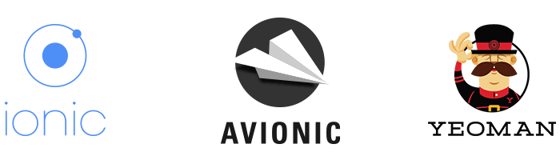

# 
###### PROPELLING WORLD-CLASS CROSS-PLATFORM HYBRID APPLICATIONS ✈.

##  ELEVATOR PITCH
A [Yeoman](http://yeoman.io) generator using [AngularJS](https://angularjs.org/), [Express](http://expressjs.com/), [ngCordova](http://ngcordova.com/), [Gulp](http://gulpjs.com/) and [Bower](http://bower.io/) that helps you kickstart highly sophisticated [Ionic](http://ionicframework.com/) projects to evolve and upgrade every aspect of your development to the next moonshot.

## SAY WHAAAT?
[AVIONIC ✈](http://avionic.io) is a mobile app creation tool for Android and iOS.

## OUR VALUES
1. We believe perfection must consider everything.
2. We take our passion beyond Code into our daily practices.
3. We are just obsessed about creating and delivering exceptional solutions.

## DISCOVER AVIONIC ✈

### FEATURES
As firm believers in the highest levels of best practice and well thought out build processes [AVIONIC ✈](http://avionic.io) takes care of providing everything needed to get started.

* Gulp jobs for development, building, emulating and running your app
* Compiles and concatenates your Sass
* Local development server with live reload, even inside ios emulator
* Automatically inject all your JS sources into `index.html`
* Auto min-safe all Angular DI through `ng-annotate`, no need to use weird bracket notation
* Comes already with [ng-cordova](http://ngcordova.com/) and [lodash](https://lodash.com) included
* generate icon font from svg files
* Blazing fast


## Project setup, installation, and configuration

### Installation

Export the repo to your local computer

You should have Yeoman installed globally

```bash
npm install -g yo
```

To install generator-avionic from npm, run:

```bash
npm link
```


NOT WORKING AT THE MOMENT FOR LIVE
To install generator-avionic from npm, run:

```bash
npm install -g generator-avionic
```

Finally, initiate the generator:

```bash
yo avionic
```

after installation, just run:
```bash
gulp
```
to start up the build job and file watchers.

In order to compile Sass, you need to have ruby and the sass ruby gem installed: `gem install sass`.

## Workflow

This doc assumes you have `gulp` globally installed (`npm install -g gulp`).
If you do not have / want gulp globally installed, you can run `npm run gulp` instead.

#### Development mode

By running just `gulp`, we start our development build process, consisting of:

- compiling, concatenating, auto-prefixing of all `.scss` files required by `app/styles/main.scss`
- creating `vendor.js` file from external sources defined in `./vendor.json`
- linting all `*.js` files `app/scripts`, see `.jshintrc` for ruleset
- automatically inject sources into `index.html` so we don't have to add / remove sources manually
- build everything into `.tmp` folder (also gitignored)
- start local development server and serve from `.tmp`
- start watchers to automatically lint javascript source files, compile scss and reload browser on changes


## What has been generated?

The folder includes an [AVIONIC ✈](http://avionic.io) basic application and backend server as a starting point.

```
AVIONIC/
├── app/
    └── index.html
    └── favicon.ico
    └── README.md
    ├── fonts/
    ├── icons/
    ├── images/
    ├── languages/
    ├── scripts/
    ├── styles/
    ├── templates/
├── bower_components/
├── helpers/
├── hooks/
├── node_modules/
├── resources/
├── server/
├── www
├── gulpfile.js
├── bower.json
├── package.json
├── vendor.json
├── config.xml

```


#### Build mode

By running just `gulp --build` or short `gulp -b`, we start gulp in build mode

- concat all `.js` sources into single `app.js` file
- version `main.css` and `app.js`
- build everything into `www`
- remove debugs messages such as `console.log` or `alert` with passing `--release`


#### Emulate

By running `gulp -e <platform>`, we can run our app in the simulator

- <platform> can be either `ios` or `android`, defaults to `ios`
- make sure to have iOS Simulator installed in XCode, as well as `ios-sim` package globally installed (`npm install -g ios-sim`)
- for Android, [Ripple](http://ripple.incubator.apache.org/) or [Genymotion](https://www.genymotion.com/) seem to be the emulators of choice
- It will run the `gulp --build` before, so we have a fresh version to test
- In iOS, it will livereload any code changes in iOS simulator

#### Emulate a specific iOS device

By running `gulp select` you will se a prompt where you can choose which ios device to emulate. This works only when you have the `gulp -e` task running in one terminal window and run `gulp select` in another terminal window.


#### Ripple Emulator

Run `gulp ripple` to open your app in a browser using ripple. This is useful for emuating a bunch of different Android devices and settings, such as geolocation, battery status, globalization and more. Note that ripple is still in beta and will show weird debug messages from time to time.


#### Run

By running `gulp -r <platform>`, we can run our app on a connected device

- <platform> can be either `ios` or `android`, defaults to `ios`
- It will run the `gulp --build` before, so we have a fresh version to test

### splash screens and icons

Replace `splash.png` and `icon.png` inside `/resources`. Then run `ionic resources`. If you only want to regenerate icons or splashs, you can run `gulp icon` or `gulp splash` shorthand.

## Our fleet

[AVIONIC ✈](http://avionic.io) is beautifully crafted by these people and a bunch of awesome [contributors](https://github.com/reedia/generator-avionic/graphs/contributors)

[](http://sebastienrousseau.com) | [](http://www.davetuplin.co.uk)
|:---:|:---:
[Sebastien Rousseau](https://github.com/sebastienrousseau) | [David Tuplin](https://github.com/tuplind)

### How to become a contributor?

* Please fill out either the individual or corporate [Contributor License Agreement (CLA)](CONTRIBUTING.md)


## History

* See [Avionic ✈ Release](https://github.com/reedia/generator-avionic/releases) list.


## License

* [MIT License](http://reedia.mit-license.org/) Copyright © Reedia Limited 2015. All rights reserved.
